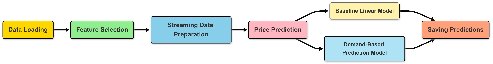
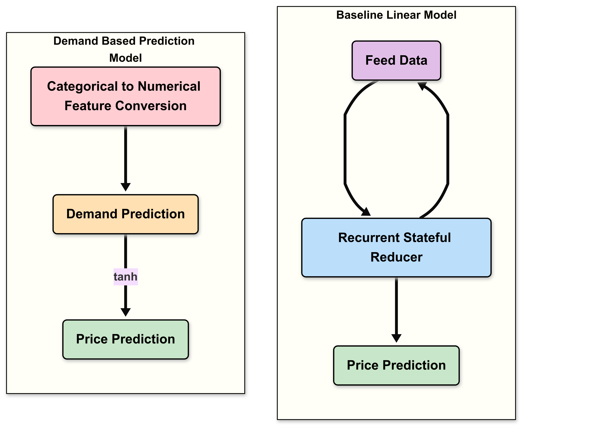
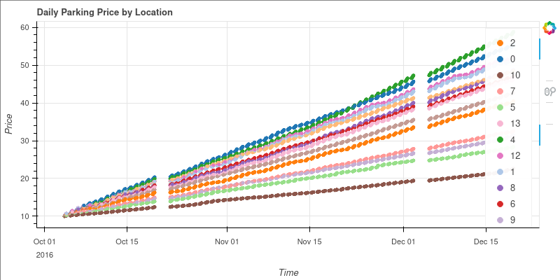
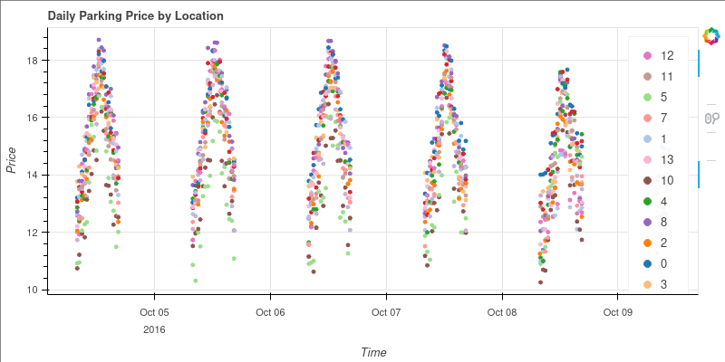
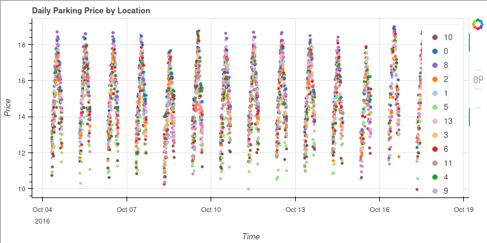

# Summer Analytics 2025 Capstone Project ~ Parking Lot Price Prediction

## Workflow
1. **Data Loading** - Load data from the Pandas dataframe and identify locations
2. **Feature Selection** - Extract relevant features like occupancy, etc. and save as csv file
3. **Streaming Data Preparation** - Load the saved data as pathway streaming table and add columns for time and day.
4. **Price Prediction** - Prediction stage using two models:
   - **Baseline Linear Model** - Predicts price based on occupancy, capacity and previous price.
   - **Demand-Based Pricing Model** - Predicts price based on various factors like queue length, traffic, special days, and vehicle type.

5. **Saving Predictions** - Stores the output from both models for plotting

## Architecture

### Baseline Linear Model
$$price_{t+1}=price_t + \alpha\frac{Occupancy}{Capacity}$$

- We can use a stateful reducer in order to model this recurrence for individual locations

- We can compare the prices between competitors by plotting them for individual locations

### Demand-Based Pricing Model

$$Demand = \alpha \frac{Occupancy}{Capacity}+\beta \times QueueLength - \gamma \times Traffic + \delta \times IsSpecialDay + \epsilon \times VehicleTypeWeight - \frac{1}{1}$$

$$Normalized-Demand = tanh(Demand)$$

$$price = Base-Price \times (1+Normalized-Demand)$$

- In order to model this price functions, we can calculate weights based on values for the parameters.

- After that, we plot the prices for various days.

# Results
## Model 1:

- The prices always increase since the price predicted at next time stemp is always greater than the price at the current time step.

## Model 2:

- It can be noticed that for a given day, the price rises during the beginning of the day and tends to fall near the end of the day.

- The price is maximum during the middle of the day.

